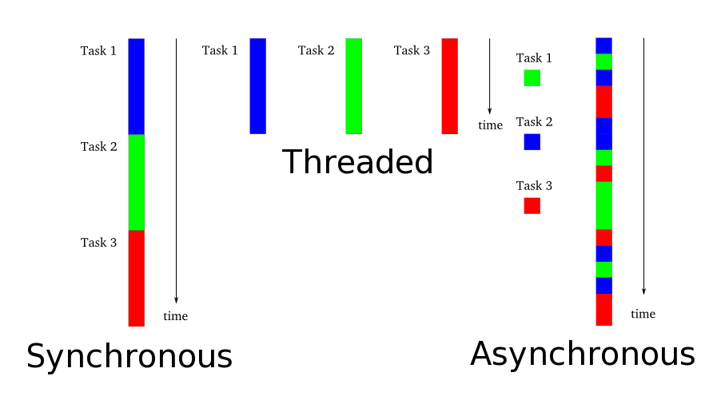

!SLIDE center
#Dive Into
    

##Matt Swanson
##@_swanson
##October 19, 2011

!SLIDE bullets
#Node is...
* Build scalable network programs
* Asynchronous, event-driven
* Server-side JavaScript environment

!SLIDE bullets
#Scalabe network programs
* HTTP, UDP, TCP, DNS, SSL
* Mainly used for HTTP
* Similar to Python's Twisted

!SLIDE center
##Quick Refresher

###[http://krondo.com/wp-content/uploads/2009/08/twisted-intro.html](http://krondo.com/wp-content/uploads/2009/08/twisted-intro.html)

!SLIDE center
#So where's the speedup?

##Frequent waiting in web apps

!SLIDE bullets
#Server-side JavaScript
* Callbacks and events are familiar
* Lingua franca for web programming
* V8 is a really freaking fast VM

!SLIDE small
    @@@ javascript
    //hello-world.js
    var http = require('http');

    var server = http.createServer(function (req, res) {
      res.writeHead(200, {"Content-Type": "text/plain"});
      res.end("Hello Node\n");
    });

    server.listen(8000);

    >> node hello-world.js

!SLIDE 
#Getting your bearings
<table class="bearing">
<tr><td style="width: 400px">So you want to...</td></tr>
<tr><td>Install node</td><td><a href="http://nodejs.org">http://nodejs.org</a></td></tr>
<tr><td>- Windows</td><td>Pre-built binary for v0.5.4 (unstable)</td></tr>
<tr><td>- OS X</td><td>>> brew install node</td></tr>
<tr><td>Package manager</td><td><a href="http://npmjs.org">http://npmjs.org</a></td></tr>
<tr><td>- Install packages</td><td>>> npm install mongoose</td></tr>
<tr><td>REPL</td><td>>> node</td></tr>
<tr><td>Run a script</td><td>>> node foo.js</td></tr>
<tr><td>Debug GDB-style</td><td>>> node debug foo.js  Add debugger statements in code</td></tr>
<tr><td>Debug GUI</td><td>Install <a href="https://github.com/dannycoates/node-inspector">node-inspector</a></td></tr>
<tr><td>Cloud deployment</td><td>heroku, no.de, nodester</td></tr>
</table>

!SLIDE
#Demo
##[Streaming Fantasy Football...kinda](http://node-altnet.herokuapp.com/)

!SLIDE bullets
#Good Use Cases
* JSON/REST APIs
* Single page AJAX
* Shell out to command line tools
* Soft realtime apps

###[http://nodeguide.com/convincing\_the\_boss.html](http://nodeguide.com/convincing_the_boss.html)

!SLIDE bullets
#Not-so-good Use Cases
* CPU bound apps
* CRUD and render
* NoSQL + Node => Buzzword BS

###[http://nodeguide.com/convincing\_the\_boss.html](http://nodeguide.com/convincing_the_boss.html)

!SLIDE bullets
#Tips
* Make it non-blocking (or non-slow)
* Node ecosystem moves fast 
* Use `package.json` to freeze dependencies
* Side-by-side architecture
* Callbacks all the way down

!SLIDE full-screen

!SLIDE center
#pretty-things.js 

##Matt Swanson
##@_swanson
##October 19, 2011

!SLIDE bullets
#How can I make pretty things? I suck at art!
* raphael.js 
* d3.js 
* three.js

!SLIDE bullets
# raphael.js
* SVG (VML fallback)
* Crappy browser compatible
* Pretty approachable for newbies

!SLIDE
# Let's draw a red circle
    var paper = Raphael(10, 50, 320, 200);
    var circle = paper.circle(50, 40, 10);
    circle.attr("fill", "#f00");
    circle.attr("stroke", "#fff");

!SLIDE full-screen
<iframe width="100%" height="100%" src="http://raphaeljs.com/polar-clock.html">
</iframe>

!SLIDE full-screen
<iframe width="100%" height="100%" src="http://raphaeljs.com/github/impact.html">
</iframe>

!SLIDE bullets
#d3.js
* Data Driven Documents
* SVG with Selectors API
* No crappy browser support
* Protovis-inspired

!SLIDE
# Let's draw a red circle
    d3.svg.arc()
    	.attr('r', 10)
    	.style('fill', '#f00')
    	.style('stroke', '#fff');

!SLIDE full-screen
<iframe width="100%" height="100%" src="http://mbostock.github.com/d3/ex/choropleth.html">
</iframe>

!SLIDE full-screen
<iframe width="100%" height="100%" src="http://www.visualizing.org/full-screen/16266">
</iframe>

!SLIDE full-screen
<iframe width="100%" height="100%" src="http://mbostock.github.com/d3/ex/force.html">
</iframe>

!SLIDE bullets
#three.js
* canvas (2d) / WebGL (3d)
* No crappy browsers
* Camera, mesh, shaders, lighting -- uh? ya...

!SLIDE smaller
# Let's draw a red circle
	renderer = new THREE.WebGLRenderer();
    camera = new THREE.Camera(VIEW_ANGLE,ASPECT, NEAR, FAR  );
    scene = new THREE.Scene();

    camera.position.z = 300;
    renderer.setSize(WIDTH, HEIGHT);

    var sphereMaterial = new THREE.MeshLambertMaterial({
        color: 0xCC0000});

    var radius = 50, segments = 16, rings = 16;
    sphere = new THREE.Mesh(
       new THREE.Sphere(radius, segments, rings),
       sphereMaterial);

    scene.addChild(sphere);
    renderer.render(scene, camera);

!SLIDE full-screen
<iframe width="100%" height="100%" src="http://mrdoob.github.com/three.js/examples/webgl_materials_normalmap2.html">
</iframe>

!SLIDE full-screen
<iframe width="100%" height="100%" src="http://data-arts.appspot.com/globe">
</iframe>

!SLIDE full-screen
<object height="100%" width="100%"><param name="allowfullscreen" value="true"><param name="allowscriptaccess" value="always"><param name="movie" value="http://vimeo.com/moogaloop.swf?clip_id=17104224&amp;server=vimeo.com&amp;show_title=1&amp;show_byline=0&amp;show_portrait=0&amp;color=00ADEF&amp;fullscreen=1&amp;autoplay=0&amp;loop=0"><embed src="http://vimeo.com/moogaloop.swf?clip_id=17104224&amp;server=vimeo.com&amp;show_title=1&amp;show_byline=0&amp;show_portrait=0&amp;color=00ADEF&amp;fullscreen=1&amp;autoplay=0&amp;loop=0" allowfullscreen="true" type="application/x-shockwave-flash" allowscriptaccess="always" height="100%" width="100%">
</object>

!SLIDE
#Questions?

