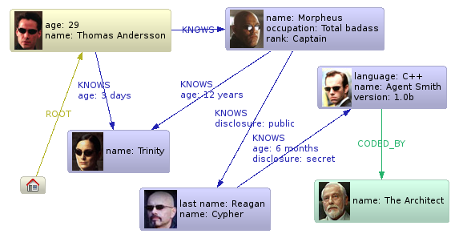

!SLIDE bullets center
   

* Stores graph data (edges, vertices)
* Both can have properties
* Transactional

!SLIDE center full-page

http://wiki.neo4j.org/content/The_Matrix

!SLIDE bullets
* Network oriented data
* Hop = Join
* Social Graph
* Spatial Graph
