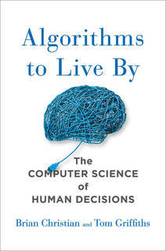
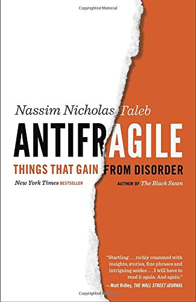
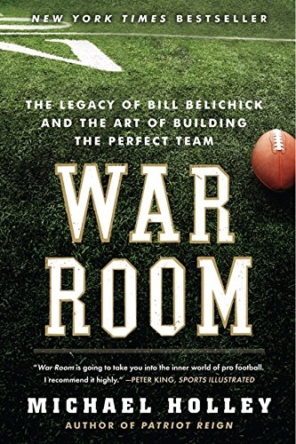
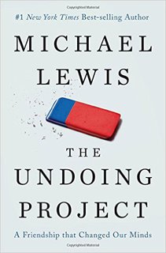
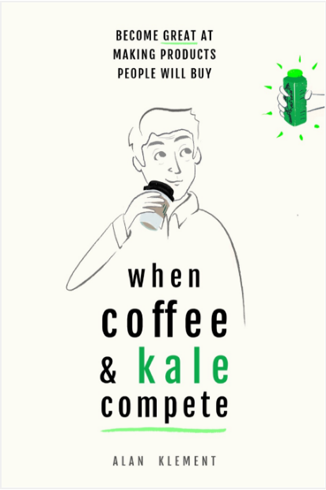

# What I've Been Reading

## A brisk :zap: talk by Matt Swanson

^ Hi. I'm Matt. I'll be talking about what I've been reading.

---

# Mindset 

It's okay to spend money on books, they are a cheap investment.

It's okay to read multiple books at once.

It's okay to not finish a book.

It's okay to not take notes or remember every word.

^ But first, a few points of order. It's okay to buy books, they are usually like $12. If you get one useful idea, it's easily worth $12. It's okay to stop reading something and then pick it up again later. Or don't pick it up again. This isn't the 3rd grade, there is no assigned reading. And lastly, it's okay to not retain everything. Good ideas will stick with you and you can always go back and re-read sections if you later need them. Don't worry if you aren't reading the right way. With that out of the way, here is what I've been reading

---

# Algorithms to Live By

## Applying computer science to real-world problems

## Consider the distribution of a system when predicting

^ My biggest insight was the discussion of how to consider the distribution of a system when trying to estimate. Even just knowing if something is Gaussian, power-law, or Erlang distributed can have a huge impact in how we predict things. If a boy is 6 years old, how long would we predict they will live? Gaussian distribution -- so use the average. A movie made $12M on opening night, what will the box office total be? Power-law distribution -- so use a multiplier.

---

# Antifragile

## An investigation of opacity, luck, uncertainty, probability, human error, risk, and decision-making in a world we don't understand

## Analysis of adaptable systems that gain from disorder

^ Some things are fragile -- they are destroyed when disorder or stress is applied. Think about a glass slipper -- if you walk around in it, it will shatter. Some are robust -- they hold steady when stress is applied. Something like a steel-toed workboot. It can take a beating and it doesn't really change. But some rare things actually improve when stress is applied. These are called antifragile -- think about a pair of fine leather shoes that become more comfortable with wear. Cool -- who cares about shoes? Nobody, but the concept of fragility when it comes to risk assessment is useful. What is more stable: if SEP had 1-2 large clients, or 15 small clients?

---

# War Room

## The art of building the perfect team

## Organizational alignment on metrics; find players with a realistic chance of being better than someone on the roster

^ Probably not a good book unless you really like football. I didn't finish this book, but I did find it interesting that Bill Belichick was able to get his entire organization aligned on a player evaluation system specifically grading how players would do in the Patriots system. The concept of only drafting players will a realistic chance to better than an existing player was also novel -- I'm curious about how we could apply something like this to, say, selecting projects we bid on.

---

# Made in America

## Biography of Sam Walton, founder of WalMart

## Do things that don't scale; always seek to learn from competitors

^ I read this book because now everyone says WalMart is evil and terrible for small towns. But like 20 years ago, everyone loved WalMart and it was a darling of American business. Biographies are hit or miss, but one thing that stuck with me was Paul Graham's "Do things that don't scale" mantra. Sam Walton, in the early days of WalMart, was opening the 2nd and 3rd stores and he was such a control-freak that he wanted to be there in person for every little thing. But traveling between locations was a day-long trip by car. So he bought a plane and learned how to fly so he could cut down on travel time. That certainly doesn't scale, but it was critical to WalMart's early success.

---

# The Undoing Project

## Biography of Kahnemann and Tversky's work on cognitive science

## Anchoring, the availability heuristic, loss aversion, and prospect theory

^ Another biography -- this time of two Israeli psychologists that basically disrupted the field of cognitive science and decision making. The pair was actually not super interesting to me -- but I did like one section about applying their learnings to reducing preventable errors in hospitals. Just like 95% of married couples don't believe the 50% divorce rate applies to them, 80% of doctors believe that statistics don't apply to their patients so applying. Imagine you had a patient comes in with an irregular heartbeat. She also tells you she has a history of thyroid problems. Thyroid problems can cause irregular heartbeat -- case closed right? Well, maybe. While hyperthyroidism can cause irregular heartbeats, it is a really infrequent cause compared to others. More statistically likely is something like a punctured lung, which could go untreated if doctors lock into the thyroid as the culprit.

---

# When Coffee and Kale Compete

## The 'Jobs to be Done' book

## Mistake of physical characteristic personas; who do customers view as your competition; ignoring context will kill you

^ Jobs to be Done is kind of hard to explain. It's a product design framework that tries to figure out what "jobs" someone "hires" a product to do. Usually the job isn't what people think. There's a common example of what the "job" of McDonald's Milkshakes are -- you can look that up if you are interested. When you frame things as jobs, you start to see unexpected competitors -- Netflix competes with Amazon Video, sure, but it also competes with Borders bookstores for the job of "introvert friendly entertainment". There's an example early in the book about an innovative company that builds a super cheap refrigerator for third-world countries. Heralded for the amazing design and engineering, it was like 1/3 the cost of existing options -- but it failed miserably when it hit the market. It wasn't competing with more expensive fridges, but rather with it was competing with things like burying clay pots, Styrofoam coolers, or simply going to the market to buy food every day. These things all did the same "job" of keeping food from spoiling.

---

# What's next?

**Pre-Suasion** (Cialdini): framing discussions and priming to influence and persuade

**Story** (McKee): elements, structure, and principles of screenwriting (sales/marketing are story telling)

**HYPERGROWTH** (Cancel): customer-driven product development framework; the "Agile killer"

**Sapiens** (Harari): a brief history of humankind

^ So that's what I've been reading. If you're curious, here are some books that are next on my list to read.
